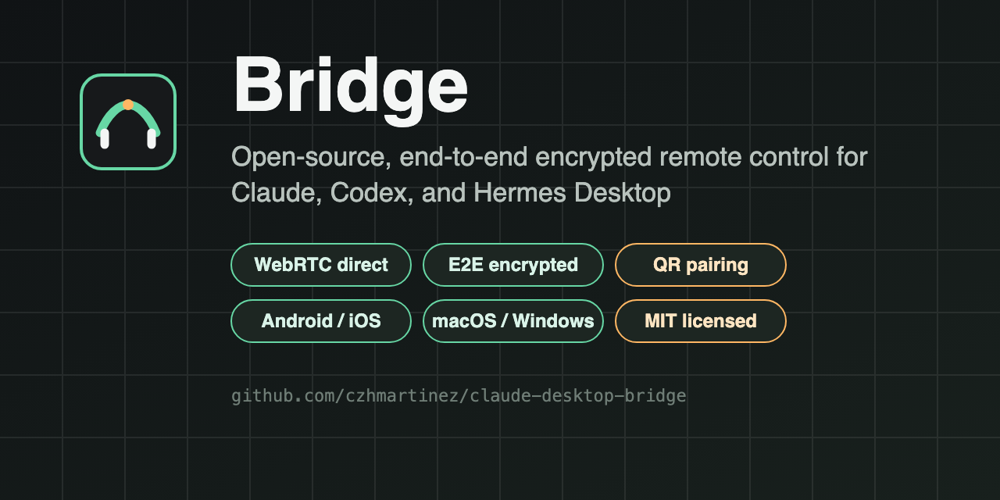
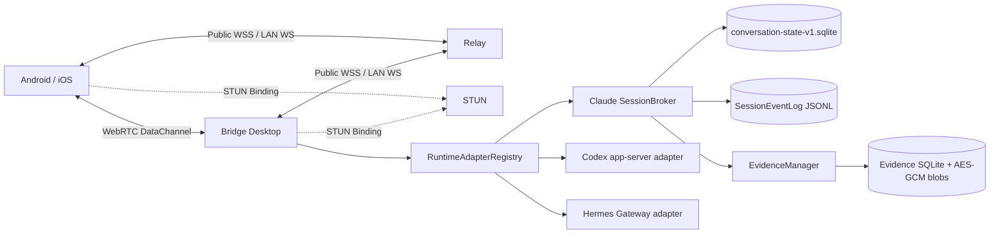

# Bridge


**Bridge** is an open-source, end-to-end encrypted remote and collaboration layer for
[Claude Desktop](https://claude.com/download), [Codex Desktop](https://developers.openai.com/codex/),
and Hermes Desktop. It gives you a consistent session list, streaming output, approvals,
follow-up questions, interrupts, and recovery across your desktop and phone, without merging
any native account, session, model, permission, or history.



[](LICENSE)
[](https://github.com/czhmartinez/claude-desktop-bridge/releases/latest)
[](https://github.com/czhmartinez/claude-desktop-bridge/actions/workflows/ci.yml)
[](CONTRIBUTING.md)

## Why Bridge

Desktop AI agents are powerful, but they are usually locked to one machine. Bridge closes
that gap with a phone-first remote experience that still respects the boundaries of each
desktop runtime:

- **Unified control, separate identities.** View, send, approve, steer, and stop Claude,
  Codex, and Hermes sessions from one place. Native sessions remain
  `(runtimeId, nativeSessionId)` identities and never silently migrate between runtimes.
- **Cross-desktop relay.** Hand a bounded, redacted, encrypted task context from one desktop
  runtime to another. Every relay requires two human confirmations and runs through a
  read-only plan first. There is no automatic failover and no credential migration.
- **End-to-end encryption.** Conversation payloads and events use per-device AES-256-GCM.
  Devices prefer a WebRTC data channel and fall back to an encrypted WSS relay; the relay
  only sees routing metadata, ciphertext, and queue sizes.
- **Local-first adapters.** Claude is integrated through its public Agent SDK and read-only
  transcript observation. Codex uses the official `codex app-server --stdio` interface that
  Bridge starts itself. Hermes uses a loopback-only Gateway with a process-scoped token.
- **Real evidence, real previews.** Remote image attachments, file-change summaries,
  artifact previews, and workspace-confined file opening are rendered as actual content on
  desktop and mobile, not bare paths.
- **Safe by default.** No accessibility permissions, no synthetic clicks, no clipboard
  access, no private CDP, no OAuth extraction, and no hidden chain-of-thought.

## Architecture

Bridge is not a remote desktop and not an input automator. It is a protocol and host layer
that exposes each desktop runtime through a uniform API while keeping every runtime's native
state in place.



The [architecture document](docs/ARCHITECTURE.md) covers the adapter contracts, relay
state machine, provider lanes, and ownership model. The [security model](docs/SECURITY.md)
describes the encryption boundaries, local permissions, artifact limits, and production
requirements.

## Features

- Session list, history, streaming output, approvals, questions, interrupts, and resume
  across Claude Desktop, Codex Desktop, and Hermes Desktop
- Model/effort/permission configuration and provider switching per runtime, exposed only
  where the runtime actually supports it
- Cross-desktop relay with plan-first execution, goal monitoring, pause/resume, and
  crash-safe recovery
- Image attachments for Claude and Codex sessions, rendered as real previews on both clients
- File-change cards that open the actual host-side file from desktop or mobile
- Session archive, delete, and tombstone sync between desktop and mobile
- Offline queues, event replay, push wake, and fast reconnect after app restarts
- Self-hostable relay with Docker/Caddy/Nginx references in `deploy/`

## Quick start

Requirements: Node.js 22.13 or newer and npm.

```bash
npm ci
npm run dev:desktop
```

This starts:

- Relay: `ws://127.0.0.1:8788/ws`
- Web/PWA client: `http://localhost:5188`
- Electron desktop host

Scan the pairing QR from the Android/iOS app or the mobile web client, then pick a desktop
runtime and start a session. Development mode converts loopback addresses to LAN addresses
automatically. Production builds use a fixed `BRIDGE_PUBLIC_RELAY_URL` so desktop and phone
do not need to share a network.

Prebuilt installers are published to
[GitHub Releases](https://github.com/czhmartinez/claude-desktop-bridge/releases/latest)
for macOS, Windows, and Android. The mobile app is built on Capacitor with iOS support in
the same source tree.

## Verification

The repository ships with unit tests, contract probes, packaged-desktop QA, real pairing
checks, Android installed-APK QA, visual QA, and GitHub Actions CI for Linux, Windows, and
Android.

```bash
npm run verify
npm run probe:relay
npm run test:visual
```

See the [contribution guide](CONTRIBUTING.md) for the full command list and release rules.

## Documentation

| Document | Purpose |
| --- | --- |
| [Architecture](docs/ARCHITECTURE.md) | Runtime adapters, relay state machine, ownership |
| [Security](docs/SECURITY.md) | Encryption model, local boundaries, production checklist |
| [Release](docs/RELEASE.md) | Versioning, signing, packaged acceptance |
| [Application & promotion](docs/OPENAI-OPEN-SOURCE.md) | OpenAI open-source application materials |

## License

MIT. See [LICENSE](LICENSE).
