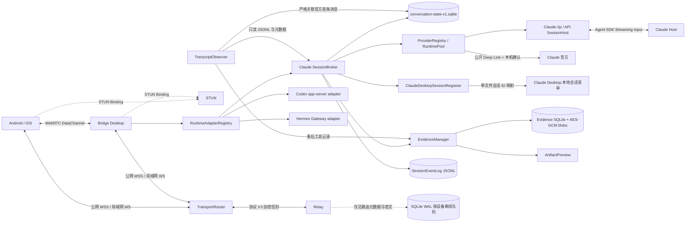
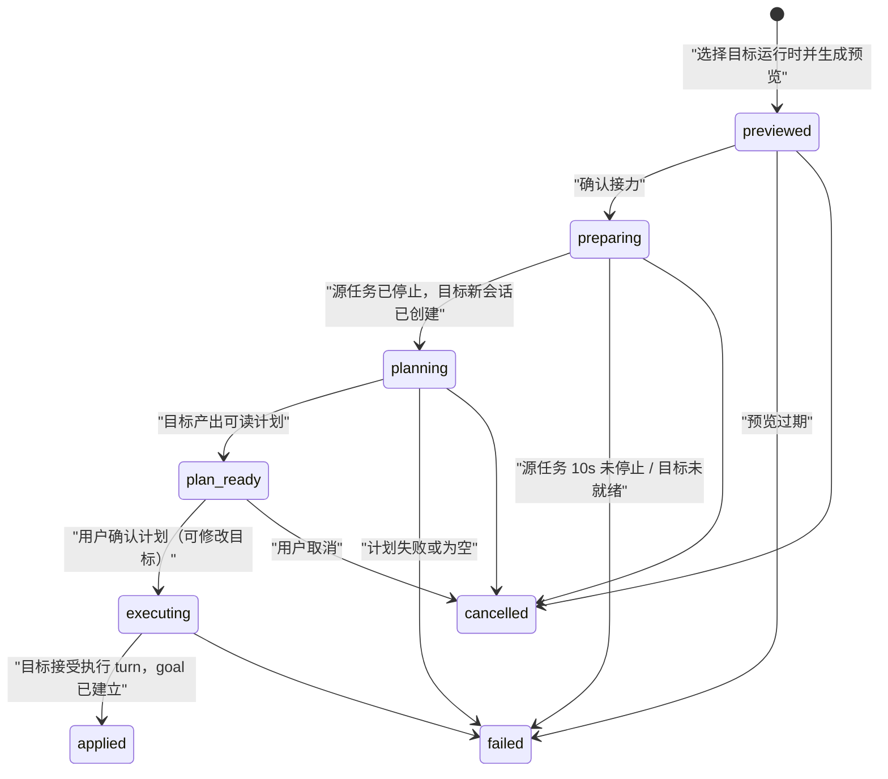
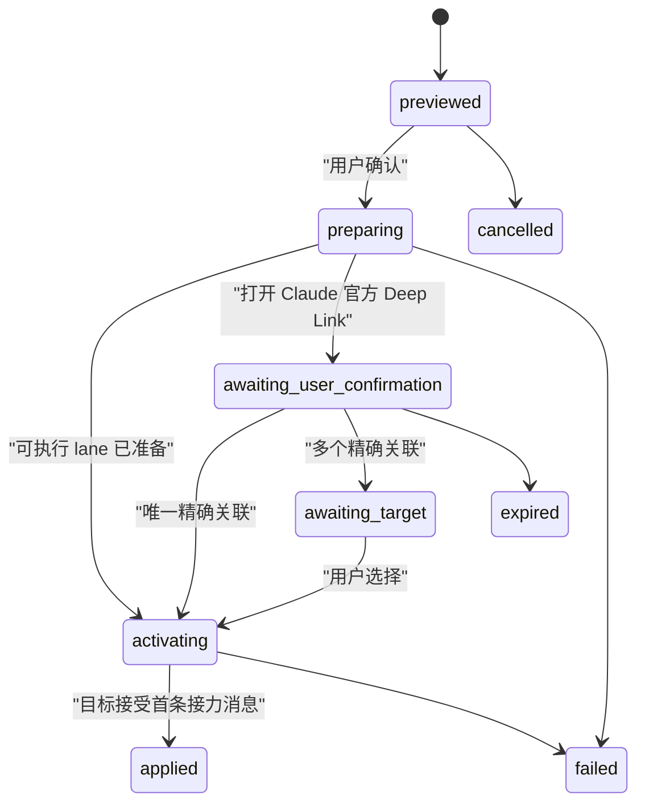
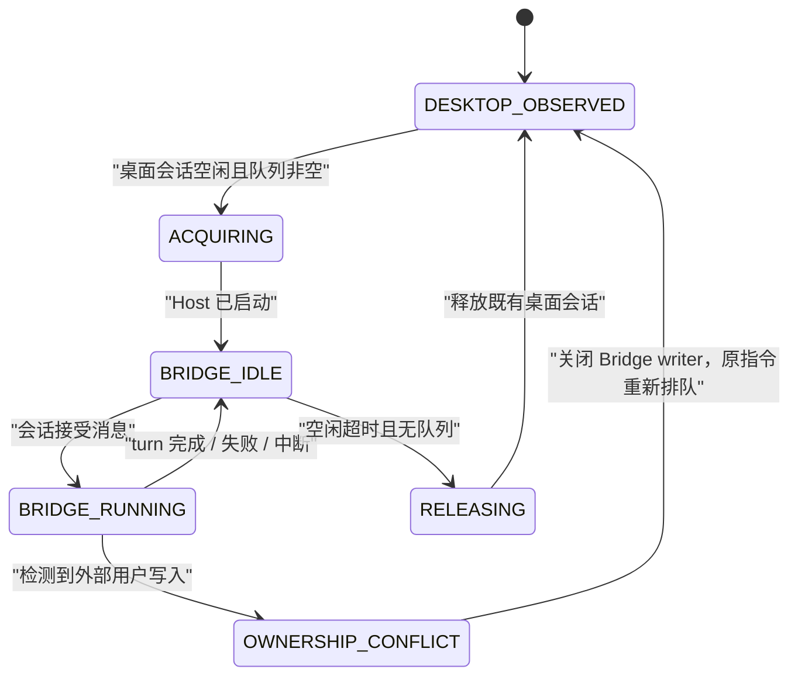

# Bridge 0.7 架构

## 产品边界

Bridge 是独立的多 Desktop 协作产品，不是远程桌面，也不是任何一个 Desktop 输入框
自动化。它统一手机与桌面上的会话列表、发送、流式输出、工具状态、审批、追问、中断和
恢复体验；Claude Desktop、Codex Desktop 与 Hermes Desktop 的账户、原生会话、模型、
权限与历史始终各自独立。0.7 新增经用户两次确认的跨 Desktop 串行接力：接力只在运行时
之间传递有界、脱敏、加密的可见上下文包，目标始终是新建原生会话，仍不构成会话迁移。
Bridge 只建立出站连接，不要求公网 IP、端口映射或额外组网客户端。

Bridge 接管 Claude Desktop 已有会话后，电脑端 Bridge 和手机共享同一会话、同一
执行进程和同一事件流。Claude Desktop 当前窗口不承诺即时刷新；释放后仍可从相同
`sessionId` 打开历史。Bridge 直接新建的会话仍由 Agent SDK 独立执行；首轮 JSONL
落盘后，`ClaudeDesktopSessionRegistrar` 可将同一个 CLI `sessionId` 登记到当前
Claude Desktop 的本地会话清单。重启 Claude Desktop 后，侧边栏从该映射打开原始
transcript，不复制历史，也不改变 Bridge 的执行归属。

## 0.6 多 Desktop 运行时

Bridge 0.6 的统一对象是操作体验，不是对话本体。每个原生会话以
`(runtimeId, nativeSessionId)` 作为不可跨运行时的唯一身份；Bridge 对外使用编码后的
`BridgeSessionInfo.sessionId`，例如 `codex-desktop:<native-id>`。因此 Codex、Hermes
和 Claude 恰好有相同原生 ID 时仍不会碰撞，也不会被放进同一段上下文。

| 运行时 | 本地适配方式 | Bridge 可统一的操作 | 明确边界 |
|---|---|---|---|
| Claude Desktop | 既有 `SessionBroker`、Agent SDK 与只读 transcript 观察 | 会话、发送、流、审批、追问、中断、证据 | Claude 内部 lane/handoff 仅属于 Claude 域 |
| Codex Desktop | Bridge 自己启动的本地 `codex app-server --stdio` | 会话、发送、steer、流、工具、审批、追问、中断 | 不附着或篡改已运行 Desktop 进程；不共享 Claude/Hermes 历史或授权 |
| Hermes Desktop | Bridge 自己启动的仅环回 Hermes Gateway，使用进程级随机令牌 | 会话、发送、steer、流、工具、审批、追问、中断 | 不读取 Desktop token/keychain；不接受非环回 Gateway 地址 |

`RuntimeAdapterRegistry` 只注册能力和健康状态，`RuntimeSessionBroker` 只做协议归一化、
事件落盘与权限路由。跨运行时接力包与接力状态由独立的 `RuntimeHandoffService` 持有；
Broker 本身仍不执行会话迁移，也不为某个 Desktop 自动故障转移到另一个 Desktop。
统一会话列表只是索引；打开后始终回到拥有该任务的原生运行时。

各 adapter 必须显式声明能力。当前共同基线为 `session.list/create/history`、
`turn.start/steer/interrupt`、`permission.resolve` 和 `tool.events`；图片附件按 adapter
能力单独开放；Codex/Hermes 的模型、provider、思考强度和快速模式通过 adapter 的
`session.configure` 调用各自 Desktop 的原生会话配置接口。Bridge UI 对所有 ready runtime
提供相同的会话、流、审批和中断操作，并在任务标题和筛选器中显示其归属。

两个外部运行时都把「新建但未发过消息」的会话只保存在内存里：Codex 线程在首个用户消息
落盘 rollout 前不出现在 `thread/list`，且 `thread/read`/`thread/resume` 直接报错；
Hermes 懒会话只接受创建时返回的临时别名（`prompt.submit`、中断、历史与全部推送事件都
走别名），`session.resume` 只认持久化后的 `stored_session_id`，落盘后的 `session.list`
行也只带 stored id。adapter 因此显式跟踪「未物化线程 / 存活别名」：历史按空返回、首轮
跳过 resume 直发、刷新时保留原生侧还列不出的会话。Hermes 的公开会话身份始终是 stored
id——它是 `session.list` 返回的唯一稳定值，Bridge 重启后接力链、goal 与手机端引用
都不会漂移；别名只在网关进程内做活操作句柄，网关事件按别名映射回 stored id。控制器
按 sessionId 的运行时归属路由，不再依据 adapter 缓存命中，避免瞬时未命中回退到错误
Broker。

手机端会话列表依赖全量快照：事件增量只更新已存在的会话，不会新增。Bridge 在每次发布
时比对会话 id 集合，新增/移除会话（接力目标、原生侧新建）都会向已配对设备推送一次
全量重同步；手机同时通过 `runtime.handoff.*` 事件实时跟进源会话上的计划门槛，通过
`runtime.goal.updated` 跟进 goal 状态，因此 PC 端可做的接力操作在手机端全部可做。

## 组件

| 组件 | 职责 |
|---|---|
| `ClaudeSessionHost` | Claude-3p / Anthropic API lane 的 Agent SDK 持久输入、流式事件、审批和中断 |
| `SessionBroker` | 稳定逻辑会话、lane 固定队列、单写入者、所有权、两路并发和幂等 |
| `RuntimeAdapterRegistry` | Codex/Hermes 本地 adapter 的发现、状态与能力注册 |
| `RuntimeSessionBroker` | `(runtimeId, nativeSessionId)` 隔离、外部运行时事件与审批的归一化 |
| `CodexAppServerAdapter` | 仅通过 Bridge 自己启动的官方 app-server JSON-RPC 访问 Codex 会话 |
| `HermesGatewayAdapter` | 仅通过本机环回 Gateway 访问 Hermes 会话，并持有进程级临时令牌 |
| `ConversationStateStore` | 独立 SQLite 中的 conversations、profiles、lanes、handoffs、queue、receipts 与迁移标记 |
| `ProviderRegistry` | 三类 profile 状态、Anthropic API Key 验证与模型发现 |
| `ProviderRuntimePool` | Claude-3p Host 凭据、Anthropic API 显式 Key、Claude 官方只读 adapter |
| `HandoffService` | 本机加密接力包、状态机、Deep Link、严格关联和原 lane 保留 |
| `RuntimeHandoffService` | 跨 Desktop 串行接力状态机、三运行时端点、goal 监督与故障恢复 |
| `TranscriptObserver` | 只读观察 Claude Desktop 会话，并增量恢复事后工具记录 |
| `ClaudeDesktopSessionRegistrar` | 动态识别 active profile，校验并登记 Bridge 会话 ID 映射 |
| `SessionEventLog` | 追加式 JSONL、单调 `seq`、delta 合并、history/cursor |
| `PermissionBroker` | `canUseTool` 与 `AskUserQuestion` 的首次有效答复 |
| `EvidenceManager` | 每轮证据生命周期、工具脱敏、变更归因、预览和传输租约 |
| `EvidenceStore` | SQLite 清单、加密内容寻址快照、保留策略和按需重建 |
| `ArtifactPreview` | 图片缩放和隔离、禁网的 HTML 静态截图 |
| `packages/protocol` | 请求/响应/事件/证据/快照、AES-GCM、设备定向 ACK |
| `BridgeTransport` | 公网与局域网使用同一 Envelope、ACK、幂等和事件 cursor |
| `WebRtcTransport` | 加密信令、五秒直连竞争、DataChannel 分块、ACK 与无缝回退 |
| `apps/relay` | 鉴权、SQLite 离线密文、分块、撤销、指标、备份和无正文推送 |
| `apps/client` | 手机三层导航和电脑轻量控制台 |

## 跨 Desktop 串行接力（0.7）

跨运行时接力由独立的 `RuntimeHandoffService` 编排，与 Claude 域内 lane 接力并行且
互不改写。它把「接力」建模为源会话到目标新建会话的**有向链接**，而不是任何意义上的
会话迁移：原生身份 `(runtimeId, nativeSessionId)` 不变，目标会话由目标运行时自己执行，
Bridge 只在两次用户确认之间传递接力包。

- **预览**：`runtime.handoff.preview` 构建加密接力包（目标草稿、有界近期对话、约束、
  未完成事项、工具/成果摘要、workspace git 状态、完整性哈希），与 0.5 lane 接力包共用
  同一套 compact/redact/workspace 采集实现（`handoff-package.ts`）。提示词上限仍为
  48,000 字符；预览 30 分钟过期。
- **确认接力**：源会话运行中先 `interruptTurn` 并有界等待 10 秒；未停止则失败且源任务
  保持原状。源队列中未发送项不迁移，仅以摘要进入未完成事项。目标会话以源 cwd 新建，
  标题为「接力自 <源标题>」。
- **计划阶段**：Codex 目标经 `thread/settings/update` 设 `collaborationMode: plan` 原生
  只读规划；Claude/Hermes 目标使用只读规划约定（写操作仍走既有审批）。计划 turn 的
  终稿 assistant 消息存为计划文本；空计划直接失败。
- **goal 执行**：用户确认计划后，Codex 目标调 `thread/goal/set` 建立原生 goal 并恢复
  default 模式，由运行时自动续跑；Claude/Hermes 目标执行带 `GOAL_STATUS:
  continue|done|blocked` 约定的指令，Bridge 在每轮结束解析标记并自动续跑（上限 20 次，
  持久化计数），done/blocked 分别进入完成/受阻。
- **停止语义**：用户在目标会话停止任务会同时暂停 goal（Codex 原生 `paused`，模拟侧停
  循环），goal 循环永不与用户停止对抗；`runtime.goal.pause/resume` 可显式控制。
- **故障闭合**：Host 重启后 `preparing` 与无 goal 的 `executing` 直接失败（绝不重发），
  `planning` 从目标历史恢复可读计划（否则失败），`applied` 的 goal 按 `runtime_goals`
  恢复监督并与 Codex `thread/goal/get` 对账。

接力状态持久化在 `conversation-state-v1.sqlite` 的 `runtime_handoffs` 与
`runtime_goals` 两表；接力链（`BridgeSessionInfo.relay`）、goal 状态
（`BridgeSessionInfo.goal`）与待确认接力（`pendingRuntimeHandoff`，快照中剥离计划
全文与原生 ID）作为增量快照字段下发。协议仍为 V3、配对 schema 仍为 V4，新增
`runtime.handoff.v1` capability 与 `runtime.handoff.*`/`runtime.goal.*` 方法事件，
旧客户端忽略并隐藏入口。

## Claude 域内逻辑对话与提供方接力

本节只描述 Claude 运行时内的 legacy provider lane。`BridgeSessionInfo.sessionId` 是稳定逻辑对话 ID。每个对话可以保留多个
`BridgeExecutionLane`，但 `conversations.active_lane_id` 始终只指向一个活动 lane。
原生会话唯一键为 `(providerProfileId, nativeSessionId)`，避免 Claude 与 Claude-3p
恰好出现相同原生 ID 时被错误合并。队列项在入队事务中固定 `laneId`，后续切换不会
把已排队指令偷偷改投其他 provider。

`preview` 只生成本机加密包并把 route 标为切换中，不改变活动 lane。可执行 lane 只有
在 `user.message.accepted` 确认接力首条消息后才原子激活；断电恢复时处于
`preparing/activating` 的接力直接失败并取消未确认队列，绝不自动重发。Claude 官方
必须同时满足 official profile、`realpath` cwd、不透明 handoff ID、首条消息完整
哈希与十分钟窗口；零匹配继续等待，多匹配进入人工选择。

完整接力包只在 Host 本机以 AES-256-GCM 保存。它包含有界可见对话、明确目标、用户
约束、未完成事项、工具/成果摘要、文件与哈希、cwd、Git HEAD/分支/脏状态、源事件
序号和完整性哈希；不包含隐藏思维、OAuth/API Key/认证头、敏感正文、项目外内容或
无界输出。Agent SDK 提示上限 48,000 字符，官方 Deep Link 上限 12,000 字符。

旧 `sessions-v2.json` 与 `turn-queue-v2.json` 通过同一 SQLite 事务幂等导入。迁移
标记保存源文件摘要；连续两次成功启动后旧文件只改名为 `.migrated`，不删除。

## 会话所有权

同一会话只允许一个实际写入者，但 Claude Desktop 的空闲会话进程可以作为只读
观察者与 Bridge Host 共存。打开、聚焦或查看会话只改变 Desktop 元数据，不会触发
冲突，也不会导致 Bridge 退出 Claude Desktop。Bridge 启动 Host 前会确认目标
transcript 已空闲并到达完成边界。

Host 启动时记录外部写入版本。`TranscriptObserver` 扫描全部近期用户分支，只有出现
无法归因给 Bridge 的新用户消息时才确认竞争写入；进程存在、文件句柄和 focus 变化
都不是写入证据。检测到真实双写时，Bridge writer 会静默关闭，原指令保持排队并在
所有权清晰后自动续跑。主机最多同时运行两个 Bridge turn。瞬态会话锁仅在消息尚未
被会话接受时重试，避免重复执行。

## 历史与事件

`TranscriptObserver` 读取 Claude 标准 JSONL 与桌面会话元数据，但不改写它们。
Bridge 自身事件写入 `events-v2.jsonl`，最终消息、工具结果、审批和状态全部持久化；
高频 assistant delta 短时合并。历史默认最近 50 条，向上用 cursor 分页。

客户端保存最后 `seq`，重连后调用 `events.resume`。Relay ACK 只表示密文已保存或
目标设备已收到；`session-received`、`running` 和最终状态只能由 Host 事件产生。

## Claude Desktop 侧边栏登记

Bridge 只为自身创建、且已经有可信 JSONL 的会话登记侧边栏。登记器在 macOS 使用
`ps`、在 Windows 使用 PowerShell，从 Claude 主进程及其 Helper 的
`--user-data-dir` 动态识别当前 profile，不硬编码 `Claude-3p`；Windows 使用
`%APPDATA%\Claude\claude-code-sessions` 作为标准会话根目录。
随后要求本机仅有一个可识别的账号会话目录，并用现有 `local_*.json` 验证格式。

目标 Desktop ID 固定为 `local_<Bridge sessionId>`。写入前同时校验 transcript 位于
`~/.claude/projects`、记录中的 `sessionId` 与 `cwd` 一致、目标路径位于已知
`claude-code-sessions` 根目录，并拒绝符号链接、路径逃逸和同名冲突。新文件通过
临时文件加硬链接原子创建，权限为 `0600`，从不覆盖已有元数据。

登记事件只向客户端暴露状态、说明、Desktop ID 与时间，不暴露 profile、账号目录、
文件路径或哈希。状态为 `waiting-transcript / unavailable / restart-required /
registered / failed`；多 profile、多账号、未知格式与异常都 fail closed。Bridge
不写 Claude 的 LevelDB，不注入进程，不使用私有 CDP。当前进程必须重启一次才能
重新加载清单，重启由用户在 Bridge 中显式触发。

## 成果证据

Bridge 任务在进入 Agent SDK 前创建证据占位和工作区基线。工具输入、进度、结果、
退出码和脱敏输出直接来自 SDK 事件；turn 结束后等待文件系统静默一秒，最多五秒，
再将结构化工具路径、命令提及路径和文件监听结果取并集。任务开始前已有的脏改动
不归入本轮；同目录并发任务、基线超限或监听不完整时，可信度降为 `partial`。

`TranscriptObserver` 对已发现的 Claude JSONL 使用 inode、字节偏移量、半行缓冲和
消息 ID 游标增量解析。它只保留 `tool_use/tool_result`、命令和路径线索，明确忽略
`thinking`，也不会为了补证据扫描项目目录。此来源固定为 `inferred`；用户打开
产物时才通过当前项目根目录校验路径、读取文件并缓存当时版本。

证据清单写入 SQLite WAL。可预览或下载的正文使用由 Electron `safeStorage` 保护的
主密钥，以 AES-256-GCM 加密为内容寻址 blob。正文达到 30 天或 1 GiB 时按 LRU
清理，清单继续保留；只有源文件哈希仍一致时才能重建失效快照。

事件 `evidence.started/updated/ready/failed` 只携带摘要和清单。`artifact.preview`
按需返回有界预览；`artifact.transfer.open/read/close` 使用 256 KiB 分块、十分钟
租约、缺块重试和最终 SHA-256 校验，单文件上限 20 MiB。产物响应为十分钟临时
消息，不进入 Relay 七天离线队列。

## 配对与推送

每次二维码生成一个十分钟有效的设备凭据。Relay 只允许该设备凭据首次绑定到一个
移动实例，之后不可复制使用，但 Relay claim 不等于端到端配对成功。手机先用临时
身份连接并发送加密 `snapshot.get`；桌面只有成功解密该请求后才记录 `pairedAt`，手机
再校验加密响应中的 `hostId` 与 `pairingEpoch`，随后才原子持久化新身份。替换配对在
确认前不会删除旧身份，失败或超时只清理本次设备 ID 的临时密文。

桌面收到 Relay `ready/presence` 时会把设备 ID 与本地非撤销设备密钥做交集。Relay
仍声称在线、但桌面已无密钥的旧设备会被立即 `device-revoke`；手机也只在成功解密
桌面消息后显示在线，不能再由 Relay presence 形成“顶部在线、会话为空”的假状态。
主机为每台设备保存独立密钥和鉴权令牌，信封带 `toDeviceId`，撤销一台设备不会影响
其他设备。

FCM/APNs 只发送 `bridge-wake` 或 `content-available`，不包含会话 ID、消息摘要或
正文。App 唤醒后再从 Relay 获取并端到端解密。

协议 V3 与配对 schema V4 有意拒绝 V0.3 设备。首次迁移保留稳定 `hostId`、设置、
会话历史和本地事件，同时提升 `pairingEpoch`，轮换房间、Host 凭据和端到端密钥，
并清空旧设备授权。手机将旧记录标为“需要重新配对”；新二维码包含相同 `hostId`，
重配后本地缓存重新挂回该主机。

Relay 端点仍与加密身份解耦，固定公网 WSS 优先，局域网端点作为候选。大信封先
加密再按 64 KiB 传输分块，Relay 不参与解密；目标端完成 SHA-256 校验、重组和
AES-GCM 解密后才发送最终 ACK。

可靠 Relay 之上同时提供 WebRTC DataChannel。手机通过加密 Envelope 发送
SDP/ICE，Relay 无法读取候选地址；STUN 只返回公网映射，不承载 Bridge 业务数据。
直连打开前仍使用 WSS，打开后相同 Envelope ID 直接传输；DataChannel 中断时，
未确认 outbox 使用原 ID 回退 Relay，因此不会重复执行指令。首版不使用 TURN，
ICE 五秒未成功即保持 WSS 路径。ICE 服务器为独立显式配置，不从 Relay 或
`serviceOrigin` 的主机名推导。

## 运行时发现

Claude-3p lane 只使用 Claude Desktop 已经存在的第三方 Host 凭据路径。Anthropic
API lane 使用相同 Agent SDK 执行内核，但先清除 Host/OAuth、Base URL、Custom
Headers 与 Bedrock/Vertex/Foundry 路由，再注入由本机 `safeStorage` 解密的显式
Console API Key。两者都设置准确 `cwd`、`resume` 和 `forkSession:false`；模型来自
对应 provider profile。Claude-3p 仍从会话元数据继承精确 `model`、`effort` 与
`[1m]`/ultracode 上下文信号。

Claude 官方 adapter 没有 Host 执行计划，只能生成公开 Deep Link；它不读取、复制或
代理官方 OAuth。若 Agent SDK 将来不兼容，唯一允许的执行降级是持久
`stream-json` 进程，不能退回单次 `-p`，也不能偷偷改用其他 provider。

## 明确不做

Bridge 不展示、存储或从行为推断隐藏 CoT，不自动故障转移，不代理官方 OAuth，也不
重新接入 Claude Desktop 私有 CDP。Bridge 0.7 不合并 Claude、Codex 与 Hermes 的
原生会话、历史、认证、模型或权限，也不在它们之间自动迁移或故障转移；跨 Desktop
接力永远是用户两次确认的手动串行操作，目标为新建原生会话。V0.7 不提供项目目录树、远程编辑器、动态站点
直播、自动启动开发服务、PDF 内嵌渲染或超过 20 MiB 的文件传输。
