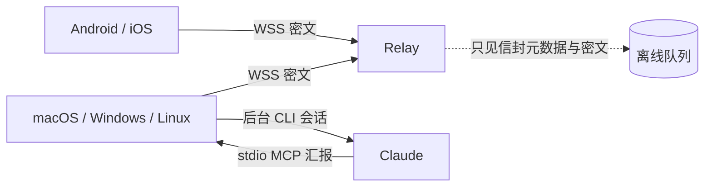

# Bridge 架构

## 产品边界

Bridge 解决的是“人在手机旁、工作在电脑上”的异步协作问题，不做远程桌面，也不把电脑端口暴露到公网。

## 为什么不用参考方案里的 Tailscale

Tailscale 本身可靠，但会让普通用户额外安装、登录和理解组网。Bridge 的桌面端与手机端都建立出站连接，由 Relay 转发，因此无需公网 IP、端口映射、防火墙规则或第三个客户端。

## 组件

| 组件 | 技术 | 职责 |
|---|---|---|
| `packages/protocol` | TypeScript + Web Crypto | 配对、密钥派生、AES-GCM、信封协议、重连客户端 |
| `apps/relay` | Node.js + WebSocket | 鉴权、在线转发、离线密文队列、确认与限流 |
| `apps/client` | React + PWA | 手机工作流与桌面渲染界面 |
| `apps/desktop` | Electron | 常驻、托盘、开机启动、配对、一键写入 Claude 配置、MCP 进程 |
| `apps/mobile` | Capacitor | Android/iOS 原生容器与原生二维码扫描 |

## 配对

1. 桌面生成 256-bit 随机根密钥与随机房间 ID。
2. HKDF-SHA-256 从根密钥分别派生内容加密密钥和 Relay 鉴权令牌。
3. 二维码承载 `https://app/#/pair/<bundle>`；手机应用可直接用内置相机识别，凭证位于 URL fragment，不会进入 HTTP 请求、访问日志或 Referer。
4. 手机导入后只持久化不可导出的 `CryptoKey` 和 Relay 令牌，原始根密钥随即丢弃。
5. 更换二维码会生成全新房间与密钥，旧手机立即失去新消息访问能力。

桌面配对密钥保存在权限为 `0600` 的用户目录配置文件中。它只用于手机与本机 Bridge 的端到端加密；不使用系统钥匙串，避免本地临时签名升级改变应用身份后卡住启动。

## 消息投递

每条消息先在发送端加密。信封头作为 AES-GCM Additional Authenticated Data，因此 Relay 即使改写发送者、目标、时间或过期时间，接收端也会拒绝解密。

Relay 在收到目标端确认前保存密文。断线重连后会重放未确认消息；客户端先落本地密文历史，再发送确认，避免“看见但没保存”的窗口。

## Claude 适配边界

当前适配器包含本地 stdio MCP、只读状态 Hooks 和后台 Claude worker。MCP 只向前台 Claude 暴露两个汇报工具：

- `bridge_send_update`
- `bridge_complete`

适配器在 MCP 初始化时声明里程碑汇报与完成通知纪律；手机收件箱不再作为前台 Claude 工具暴露，避免同一指令被多个入口消费。

手机指令带目标 Claude 会话 ID。Bridge 桌面主进程始终启动一个常驻 worker，因此没有活动 Claude 会话时手机仍可主动发起。它会先在 Claude Desktop 的标准数据目录查找权限收紧的 `host-creds-*.json`，只检查文件名、权限和修改时间，再把路径交给 Claude CLI；Bridge 从不打开文件内容。这样可以复用 Claude Desktop 已有的企业、Gateway 或代理登录。

找不到有效的 Host 凭据时，Bridge 只显示第三方通道未就绪并继续周期性检测，不发起官方 Claude OAuth 登录，也不回退到本机官方 OAuth 凭据。Claude Desktop 启动 Bridge MCP 连接器时，还会增加一个继承当前第三方会话环境的补充 worker。

桌面协调器对每个源会话串行发放带租约的任务，所有 worker 都使用 Claude Code 非交互模式执行并回传结构化结果。常驻 worker 会周期性重新检查登录状态，用户完成一次登录后无需重启 Bridge，队列会自动继续。

空闲会话直接 `--resume`，让后续历史仍属于原会话；源会话仍在运行时使用 `--fork-session`，避免两个 Claude 进程交错写同一 transcript。分支映射持久化在 Bridge 用户数据目录，手机读取历史时合并源会话与后台分支。worker 崩溃或失联时租约到期，未确认密文仍保留在队列中。Hooks 始终返回空决策，只观察启动、权限等待和工具失败等状态，绝不向 Claude 上下文注入手机内容。

Claude Desktop 当前打开的 Code 会话由其父进程通过私有 `stream-json` 输入流驱动，未提供可供第三方调用的本地消息注入 API。Bridge 不修改 Claude 安装包、不附加到该进程，也不使用辅助功能抢占输入框。因此，运行中会话的手机续写属于 Bridge 管理的隔离分支，结果显示在手机和 Bridge 电脑端，不承诺当前 Claude Desktop 窗口同步变化。
