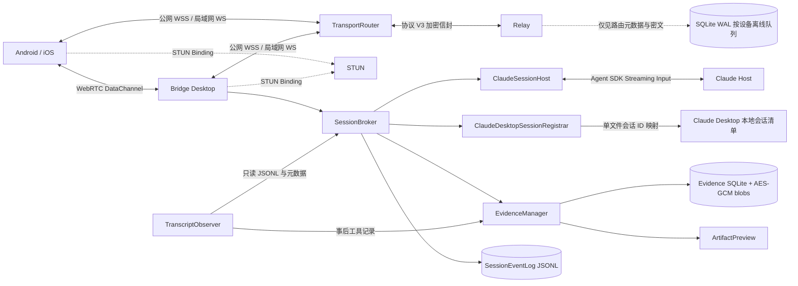
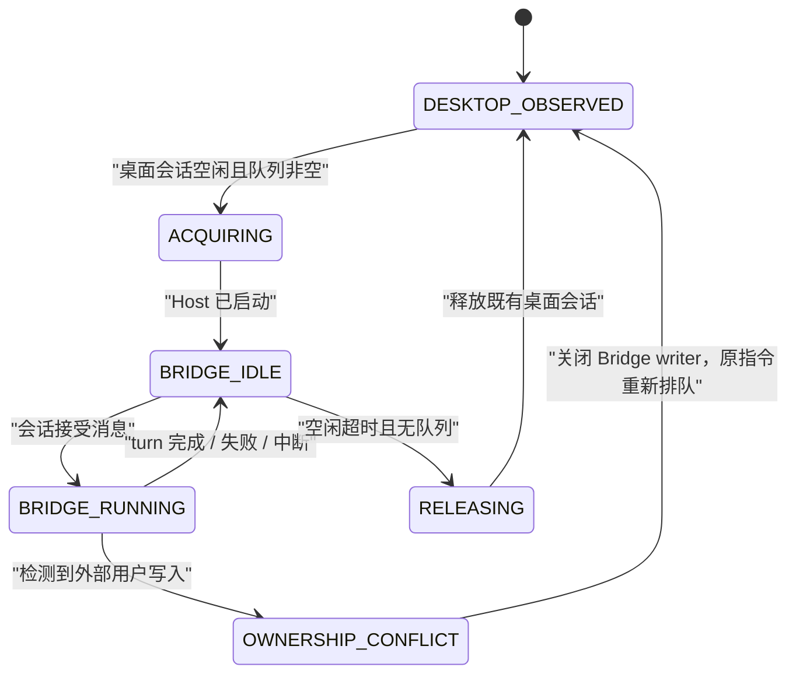

# Bridge 0.4.2 架构

## 产品边界

Bridge 是 Claude 会话客户端，不是远程桌面，也不是 Claude Desktop 输入框
自动化。它只建立出站连接，不要求公网 IP、端口映射或额外组网客户端。

Bridge 接管 Claude Desktop 已有会话后，电脑端 Bridge 和手机共享同一会话、同一
执行进程和同一事件流。Claude Desktop 当前窗口不承诺即时刷新；释放后仍可从相同
`sessionId` 打开历史。Bridge 直接新建的会话仍由 Agent SDK 独立执行；首轮 JSONL
落盘后，`ClaudeDesktopSessionRegistrar` 可将同一个 CLI `sessionId` 登记到当前
Claude Desktop 的本地会话清单。重启 Claude Desktop 后，侧边栏从该映射打开原始
transcript，不复制历史，也不改变 Bridge 的执行归属。

## 组件

| 组件 | 职责 |
|---|---|
| `ClaudeSessionHost` | Agent SDK 持久输入、准确 resume、流式事件、工具审批和中断 |
| `SessionBroker` | 单写入者、所有权状态、两路并发、持久队列和幂等 |
| `TranscriptObserver` | 只读观察 Claude Desktop 会话，并增量恢复事后工具记录 |
| `ClaudeDesktopSessionRegistrar` | 动态识别 active profile，校验并登记 Bridge 会话 ID 映射 |
| `SessionEventLog` | 追加式 JSONL、单调 `seq`、delta 合并、history/cursor |
| `PermissionBroker` | `canUseTool` 与 `AskUserQuestion` 的首次有效答复 |
| `EvidenceManager` | 每轮证据生命周期、工具脱敏、变更归因、预览和传输租约 |
| `EvidenceStore` | SQLite 清单、加密内容寻址快照、保留策略和按需重建 |
| `ArtifactPreview` | 图片缩放和隔离、禁网的 HTML 静态截图 |
| `packages/protocol` | 请求/响应/事件/证据/快照、AES-GCM、设备定向 ACK |
| `BridgeTransport` | 公网与局域网使用同一 Envelope、ACK、幂等和事件 cursor |
| `WebRtcTransport` | 加密信令、五秒直连竞争、DataChannel 分块、ACK 与无缝回退 |
| `apps/relay` | 鉴权、SQLite 离线密文、分块、撤销、指标、备份和无正文推送 |
| `apps/client` | 手机三层导航和电脑轻量控制台 |

## 会话所有权

同一会话只允许一个实际写入者，但 Claude Desktop 的空闲会话进程可以作为只读
观察者与 Bridge Host 共存。打开、聚焦或查看会话只改变 Desktop 元数据，不会触发
冲突，也不会导致 Bridge 退出 Claude Desktop。Bridge 启动 Host 前会确认目标
transcript 已空闲并到达完成边界。

Host 启动时记录外部写入版本。`TranscriptObserver` 扫描全部近期用户分支，只有出现
无法归因给 Bridge 的新用户消息时才确认竞争写入；进程存在、文件句柄和 focus 变化
都不是写入证据。检测到真实双写时，Bridge writer 会静默关闭，原指令保持排队并在
所有权清晰后自动续跑。主机最多同时运行两个 Bridge turn。瞬态会话锁仅在消息尚未
被会话接受时重试，避免重复执行。

## 历史与事件

`TranscriptObserver` 读取 Claude 标准 JSONL 与桌面会话元数据，但不改写它们。
Bridge 自身事件写入 `events-v2.jsonl`，最终消息、工具结果、审批和状态全部持久化；
高频 assistant delta 短时合并。历史默认最近 50 条，向上用 cursor 分页。

客户端保存最后 `seq`，重连后调用 `events.resume`。Relay ACK 只表示密文已保存或
目标设备已收到；`session-received`、`running` 和最终状态只能由 Host 事件产生。

## Claude Desktop 侧边栏登记

Bridge 只为自身创建、且已经有可信 JSONL 的会话登记侧边栏。登记器从 Claude 主进程
及其 Helper 的 `--user-data-dir` 动态识别当前 profile，不硬编码 `Claude-3p`；
随后要求本机仅有一个可识别的账号会话目录，并用现有 `local_*.json` 验证格式。

目标 Desktop ID 固定为 `local_<Bridge sessionId>`。写入前同时校验 transcript 位于
`~/.claude/projects`、记录中的 `sessionId` 与 `cwd` 一致、目标路径位于已知
`claude-code-sessions` 根目录，并拒绝符号链接、路径逃逸和同名冲突。新文件通过
临时文件加硬链接原子创建，权限为 `0600`，从不覆盖已有元数据。

登记事件只向客户端暴露状态、说明、Desktop ID 与时间，不暴露 profile、账号目录、
文件路径或哈希。状态为 `waiting-transcript / unavailable / restart-required /
registered / failed`；多 profile、多账号、未知格式与异常都 fail closed。Bridge
不写 Claude 的 LevelDB，不注入进程，不使用私有 CDP。当前进程必须重启一次才能
重新加载清单，重启由用户在 Bridge 中显式触发。

## 成果证据

Bridge 任务在进入 Agent SDK 前创建证据占位和工作区基线。工具输入、进度、结果、
退出码和脱敏输出直接来自 SDK 事件；turn 结束后等待文件系统静默一秒，最多五秒，
再将结构化工具路径、命令提及路径和文件监听结果取并集。任务开始前已有的脏改动
不归入本轮；同目录并发任务、基线超限或监听不完整时，可信度降为 `partial`。

`TranscriptObserver` 对已发现的 Claude JSONL 使用 inode、字节偏移量、半行缓冲和
消息 ID 游标增量解析。它只保留 `tool_use/tool_result`、命令和路径线索，明确忽略
`thinking`，也不会为了补证据扫描项目目录。此来源固定为 `inferred`；用户打开
产物时才通过当前项目根目录校验路径、读取文件并缓存当时版本。

证据清单写入 SQLite WAL。可预览或下载的正文使用由 Electron `safeStorage` 保护的
主密钥，以 AES-256-GCM 加密为内容寻址 blob。正文达到 30 天或 1 GiB 时按 LRU
清理，清单继续保留；只有源文件哈希仍一致时才能重建失效快照。

事件 `evidence.started/updated/ready/failed` 只携带摘要和清单。`artifact.preview`
按需返回有界预览；`artifact.transfer.open/read/close` 使用 256 KiB 分块、十分钟
租约、缺块重试和最终 SHA-256 校验，单文件上限 20 MiB。产物响应为十分钟临时
消息，不进入 Relay 七天离线队列。

## 配对与推送

每次二维码生成一个十分钟有效的设备凭据。Relay 只允许该设备凭据首次绑定到一个
移动实例，之后不可复制使用。主机为每台设备保存独立密钥和鉴权令牌，信封带
`toDeviceId`，撤销一台设备不会影响其他设备。

FCM/APNs 只发送 `bridge-wake` 或 `content-available`，不包含会话 ID、消息摘要或
正文。App 唤醒后再从 Relay 获取并端到端解密。

协议 V3 与配对 schema V4 有意拒绝 V0.3 设备。首次迁移保留稳定 `hostId`、设置、
会话历史和本地事件，同时提升 `pairingEpoch`，轮换房间、Host 凭据和端到端密钥，
并清空旧设备授权。手机将旧记录标为“需要重新配对”；新二维码包含相同 `hostId`，
重配后本地缓存重新挂回该主机。

Relay 端点仍与加密身份解耦，固定公网 WSS 优先，局域网端点作为候选。大信封先
加密再按 64 KiB 传输分块，Relay 不参与解密；目标端完成 SHA-256 校验、重组和
AES-GCM 解密后才发送最终 ACK。

可靠 Relay 之上同时提供 WebRTC DataChannel。手机通过加密 Envelope 发送
SDP/ICE，Relay 无法读取候选地址；STUN 只返回公网映射，不承载 Bridge 业务数据。
直连打开前仍使用 WSS，打开后相同 Envelope ID 直接传输；DataChannel 中断时，
未确认 outbox 使用原 ID 回退 Relay，因此不会重复执行指令。首版不使用 TURN，
ICE 五秒未成功即保持 WSS 路径。ICE 服务器为独立显式配置，不从 Relay 或
`serviceOrigin` 的主机名推导。

## 运行时发现

Bridge 只使用 Claude Desktop 已经存在的第三方 Host 凭据路径，不提供官方 OAuth
登录，也不回退到官方账户存储。实际执行由 `@anthropic-ai/claude-agent-sdk`
驱动，设置 `resume`、准确 `cwd` 和 `forkSession:false`。Bridge 同时从 Claude
Desktop 会话元数据继承精确 `model` 与 `effort`，包括 `[1m]` 上下文后缀，避免
恢复自定义模型别名时静默退回默认上下文通道。如果 SDK 将来不兼容，
唯一允许的降级是持久 `stream-json` 进程，不能退回单次 `-p`。

## 明确不做

Bridge 不展示、存储或从行为推断隐藏 CoT，也不重新接入 Claude Desktop 私有 CDP。
V0.4 不提供项目目录树、远程编辑器、动态站点直播、自动启动开发服务、PDF 内嵌
渲染或超过 20 MiB 的文件传输。
