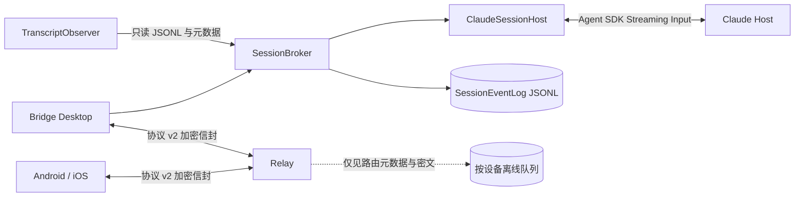
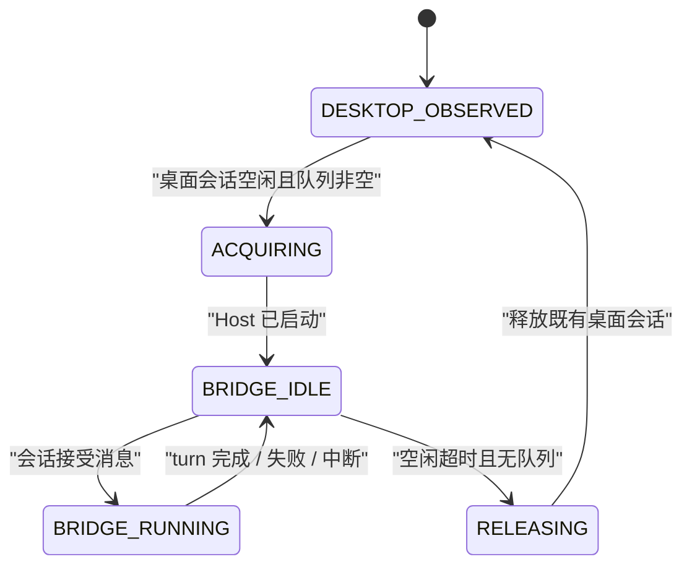

# Bridge 0.2 架构

## 产品边界

Bridge 是 Claude 会话客户端，不是远程桌面，也不是 Claude Desktop 输入框
自动化。它只建立出站连接，不要求公网 IP、端口映射或额外组网客户端。

Bridge 接管后，电脑端 Bridge 和手机共享同一会话、同一执行进程和同一事件流。
Claude Desktop 当前窗口不承诺即时刷新；释放后仍可从相同 `sessionId` 打开历史。

## 组件

| 组件 | 职责 |
|---|---|
| `ClaudeSessionHost` | Agent SDK 持久输入、准确 resume、流式事件、工具审批和中断 |
| `SessionBroker` | 单写入者、所有权状态、两路并发、持久队列和幂等 |
| `TranscriptObserver` | 只读观察 Claude Desktop 会话、历史和运行状态 |
| `SessionEventLog` | 追加式 JSONL、单调 `seq`、delta 合并、history/cursor |
| `PermissionBroker` | `canUseTool` 与 `AskUserQuestion` 的首次有效答复 |
| `packages/protocol` | 请求/响应/事件/快照、AES-GCM、设备定向 ACK |
| `apps/relay` | 鉴权、定向转发、离线密文、撤销和无正文推送唤醒 |
| `apps/client` | 手机三层导航和电脑轻量控制台 |

## 会话所有权

同一会话只允许一个 Bridge 写入者。桌面原进程仍活动时，手机消息会先持久化并
显示为“已排队”；观察器确认空闲后自动接管。主机最多同时运行两个 Bridge turn。
瞬态会话锁仅在消息尚未被会话接受时重试，避免重复执行。

## 历史与事件

`TranscriptObserver` 读取 Claude 标准 JSONL 与桌面会话元数据，但不改写它们。
Bridge 自身事件写入 `events-v2.jsonl`，最终消息、工具结果、审批和状态全部持久化；
高频 assistant delta 短时合并。历史默认最近 50 条，向上用 cursor 分页。

客户端保存最后 `seq`，重连后调用 `events.resume`。Relay ACK 只表示密文已保存或
目标设备已收到；`session-received`、`running` 和最终状态只能由 Host 事件产生。

## 配对与推送

每次二维码生成一个十分钟有效的设备凭据。Relay 只允许该设备凭据首次绑定到一个
移动实例，之后不可复制使用。主机为每台设备保存独立密钥和鉴权令牌，信封带
`toDeviceId`，撤销一台设备不会影响其他设备。

FCM/APNs 只发送 `bridge-wake` 或 `content-available`，不包含会话 ID、消息摘要或
正文。App 唤醒后再从 Relay 获取并端到端解密。

## 运行时发现

Bridge 只使用 Claude Desktop 已经存在的第三方 Host 凭据路径，不提供官方 OAuth
登录，也不回退到官方账户存储。实际执行由 `@anthropic-ai/claude-agent-sdk`
驱动，设置 `resume`、准确 `cwd` 和 `forkSession:false`。Bridge 同时从 Claude
Desktop 会话元数据继承精确 `model` 与 `effort`，包括 `[1m]` 上下文后缀，避免
恢复自定义模型别名时静默退回默认上下文通道。如果 SDK 将来不兼容，
唯一允许的降级是持久 `stream-json` 进程，不能退回单次 `-p`。
