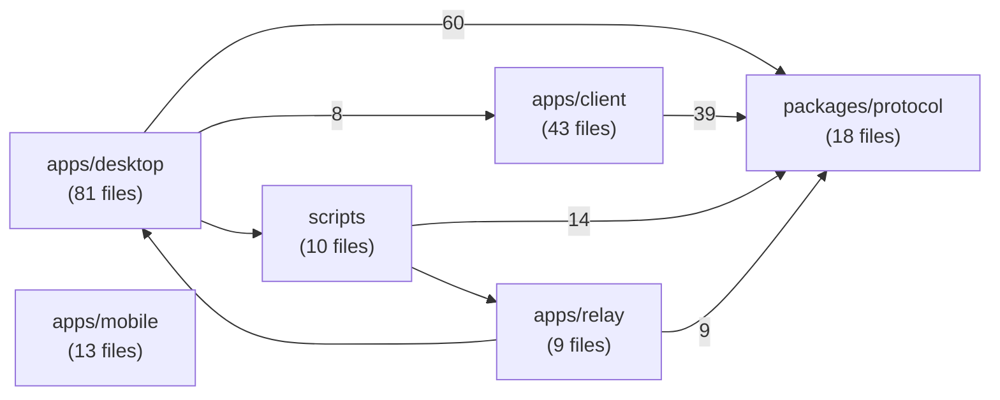

# Claude Bridge · 项目知识图谱报告

> 生成时间：2026-08-13  ·  数据源：CodeGraph 索引（.codegraph/codegraph.db）

扫描范围：**185 个文件**，**2951 个符号**，**451 条文件间 import 依赖**（符号级关系 9443 条）。

## 一、总体架构（模块概览）

下面的图只保留到“模块”这一层，比逐文件的力导向图更容易看：

## 二、模块清单

| 模块 | 文件数 | 符号数 | 被依赖(入) | 依赖(出) | 角色判断 |
|---|---:|---:|---:|---:|---|
| `apps/desktop` | 81 | 2284 | 2 | 69 | 桌面端 |
| `apps/client` | 43 | 514 | 8 | 39 | 前端 Web 客户端 |
| `packages/protocol` | 18 | 598 | 122 | 0 | 协议/类型定义（被最多依赖） |
| `apps/mobile` | 13 | 65 | 0 | 0 | 移动端 |
| `scripts` | 10 | 211 | 1 | 15 | 构建/测试脚本 |
| `apps/relay` | 9 | 192 | 1 | 10 | 中继服务 |
| `.github` | 6 | 0 | 0 | 0 | 其他 |
| `.tmp-render-brand.mjs` | 1 | 7 | 0 | 0 | 其他 |
| `deploy` | 1 | 0 | 0 | 0 | 部署配置 |
| `docker-compose.yml` | 1 | 0 | 0 | 0 | 其他 |
| `site` | 1 | 4 | 0 | 0 | 官网/站点 |
| `tmp` | 1 | 32 | 0 | 1 | 其他 |

> 说明：`apps/mobile` 在 import 图中为孤立节点，原因是它主要是 Android(Java)/iOS(Swift) 与配置文件，未被 TS 侧 import 解析连通。`.github`、`deploy`、`site` 等为配置/站点文件，未参与代码 import 图。

## 三、God Nodes（连接度最高的文件）

这些文件是项目的信息枢纽，先读懂它们就能抓住大部分结构：

| 文件 | 模块 | 被依赖 | 依赖 | 总连接 |
|---|---|---:|---:|---:|
| `packages/protocol/src/types.ts` | `packages/protocol` | 73 | 0 | 73 |
| `apps/desktop/src/main.ts` | `apps/desktop` | 0 | 27 | 27 |
| `apps/desktop/src/controller.ts` | `apps/desktop` | 4 | 20 | 24 |
| `apps/client/src/components/MobileWorkspace.tsx` | `apps/client` | 4 | 19 | 23 |
| `apps/desktop/src/session-broker.ts` | `apps/desktop` | 8 | 15 | 23 |
| `packages/protocol/src/crypto.ts` | `packages/protocol` | 18 | 4 | 22 |
| `apps/client/src/hooks/useMobileBridge.ts` | `apps/client` | 7 | 13 | 20 |
| `apps/client/src/components/DesktopDashboard.tsx` | `apps/client` | 2 | 17 | 19 |
| `apps/desktop/src/session-event-log.ts` | `apps/desktop` | 16 | 2 | 18 |
| `packages/protocol/src/socket.ts` | `packages/protocol` | 13 | 4 | 17 |
| `apps/desktop/src/conversation-state-store.ts` | `apps/desktop` | 13 | 3 | 16 |
| `apps/desktop/src/evidence-manager.ts` | `apps/desktop` | 10 | 4 | 14 |
| `apps/desktop/src/handoff-service.ts` | `apps/desktop` | 3 | 11 | 14 |
| `apps/client/src/lib/vault.ts` | `apps/client` | 7 | 6 | 13 |
| `apps/desktop/src/platform.ts` | `apps/desktop` | 11 | 2 | 13 |
| `apps/client/src/App.tsx` | `apps/client` | 4 | 8 | 12 |
| `apps/desktop/src/claude-session-catalog.ts` | `apps/desktop` | 8 | 4 | 12 |
| `packages/protocol/src/encoding.ts` | `packages/protocol` | 12 | 0 | 12 |
| `packages/protocol/src/endpoints.ts` | `packages/protocol` | 11 | 1 | 12 |
| `packages/protocol/src/ice.ts` | `packages/protocol` | 11 | 1 | 12 |

## 四、跨模块关键依赖

| 方向 | 依赖条数 |
|---|---:|
| `apps/desktop` → `packages/protocol` | 60 |
| `apps/client` → `packages/protocol` | 39 |
| `scripts` → `packages/protocol` | 14 |
| `apps/relay` → `packages/protocol` | 9 |
| `apps/desktop` → `apps/client` | 8 |
| `apps/desktop` → `scripts` | 1 |
| `apps/relay` → `apps/desktop` | 1 |
| `scripts` → `apps/relay` | 1 |

## 五、建议的探索问题

- `packages/protocol/src/types.ts` 被 73 个文件引用，它承担了什么公共能力？
- `packages/protocol/src/crypto.ts` 被 18 个文件引用，它承担了什么公共能力？
- `apps/desktop/src/session-event-log.ts` 被 16 个文件引用，它承担了什么公共能力？
- `apps/desktop` 与 `packages/protocol` 之间有 60 处引用，边界是否清晰、是否有循环依赖？
- `apps/client` 与 `packages/protocol` 之间有 39 处引用，边界是否清晰、是否有循环依赖？
- `scripts` 与 `packages/protocol` 之间有 14 处引用，边界是否清晰、是否有循环依赖？
